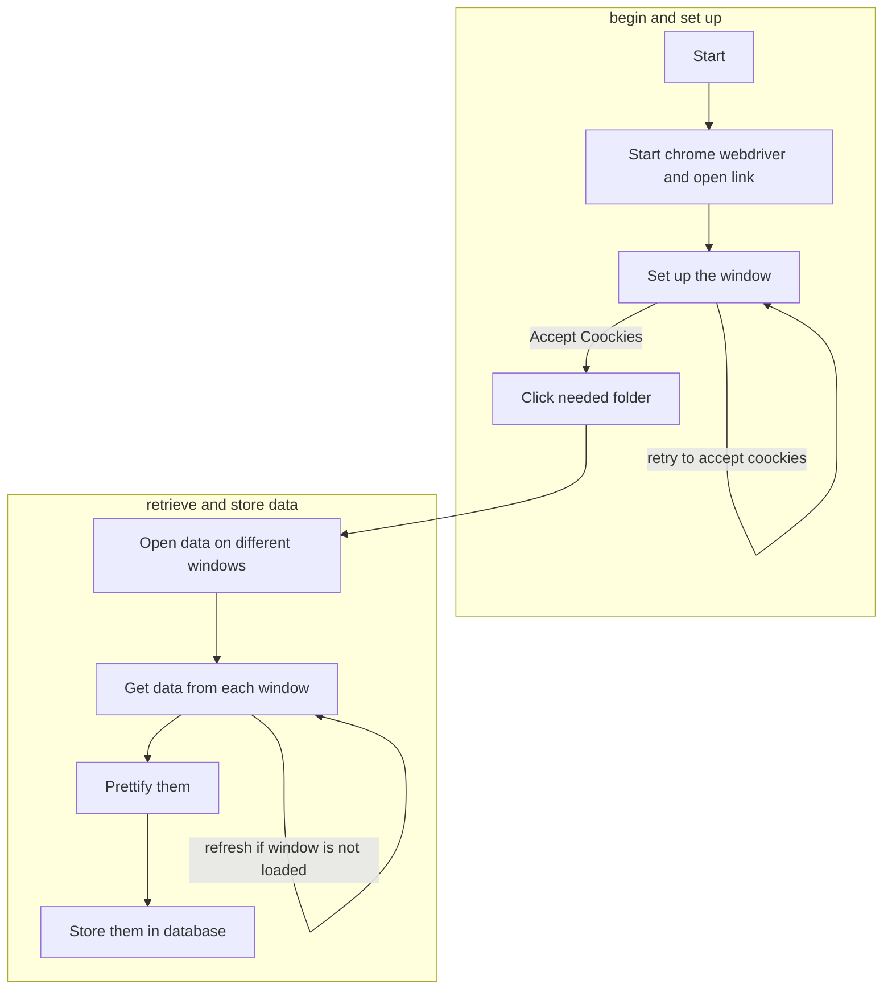

# Tourism in Greece and Spain

This is a **Web Scrapping** program, using **selenium**.

It is getting info from [**europa-eurostat**](https://ec.europa.eu/eurostat/web/tourism/data/database "eurostat database") database about:

1. Arrivals at tourist accommodation establishments
2. Arrivals of non-residents at tourist accommodation establishments - 1990-2011 - world geographical breakdown
3. Nights spent at tourist accommodation establishments
4. Nights spent by non-residents at tourist accommodation establishments - 1990-2011 - world geographical breakdown

in Greece and Spain and stores them in a sqlite database

## Contents

- [Tourism in Greece and Spain](#tourism-in-greece-and-spain)
  - [Contents](#contents)
  - [Libraries Used](#libraries-used)
  - [Files](#files)
  - [How to Use](#how-to-use)
  - [Database Configuration](#database-configuration)
    - [**nights_tour**](#nights_tour)
    - [**nights_non_residents**](#nights_non_residents)
    - [**arrivals_tour**](#arrivals_tour)
    - [**arrivals_non_residents**](#arrivals_non_residents)
  - [How does it works?](#how-does-it-works)

## Libraries Used

This program is made for **_windows_** and exclusively in **_python_** so it needs these libraries in order to run:

1. **selenium**
2. **os**
3. **sqlite3**
4. **pandas**
5. **chromedriver_autoinstaller**

## Files

There are 5 python files in the project. Each one does something different from the other one.

1. **setup_db.py**. This file sets up the database that we are gonna need, in order to save the data in the end. The Button "Create database" runs this file. It requires only the library:
   - **sqlite3**
2. **check_db_info.py**. This file prints the information that is already stored in our database. The Button "Check Saved Info" runs this file. It requires only the library:
   - **sqlite3**
3. **create_csv.py**. This file exports the stored information to 4 different csv files, one for each table in our database. The Button "Create CSVs" runs this file. It requires the libraries:
   - **pandas**
   - **sqlite3**
4. **delete_everything_from_db.py**. This file exist just to delete everything from the database, so that the main program can run again. The Button "Delete all data from database" runs this file. It requires only the library:
   - **sqlite3**
5. Finally **get_info_from_webpage.py**. This is the main program. It opens europa website and retrieves the desired data. The Button "Retrieve data from Web" runs this file. It requires the libraries:
   - **sqlite3**
   - **selenium**
   - **chromedriver_autoinstaller**
   - **os**

## How to Use

> I am assuming that you have installed all the required libraries

- First of all you have to run the file **Tourism_in_Greece_Spain** which starts the main GUI
- After that, you have to setup the database, by clicking the **Create database** button. You have to know that tables of database will not be created if they exist already
- After your database is set, you can click the **Retrieve data from Web** button. It will open all the pages containing the information we want and store them into the database
- Finally, click the **Check Saved Info** button that opens a new window showing all stored data (if there are)
  - If you would like to store the data in csv format, you can click the **Create CSVs** button. You csv files will be in the folder named **csv files**

## Database Configuration

There are 4 tables in database.

### **nights_tour**

> |  column  | datatype | Primary key |
> | :------: | :------: | :---------: |
> | country  |   text   |   &#9745;   |
> | Y2020M07 |   text   |   &#9744;   |
> | Y2020M08 |   text   |   &#9744;   |
> | Y2020M09 |   text   |   &#9744;   |
> | Y2020M10 |   text   |   &#9744;   |
> | Y2020M11 |   text   |   &#9744;   |
> | Y2020M12 |   text   |   &#9744;   |
> | Y2020M01 |   text   |   &#9744;   |
> | Y2020M02 |   text   |   &#9744;   |
> | Y2020M03 |   text   |   &#9744;   |
> | Y2020M04 |   text   |   &#9744;   |

### **nights_non_residents**

> |  column  | datatype | Primary key |
> | :------: | :------: | :---------: |
> | country  |   text   |   &#9745;   |
> | Y2020M03 |   text   |   &#9744;   |
> | Y2020M04 |   text   |   &#9744;   |
> | Y2020M05 |   text   |   &#9744;   |
> | Y2020M06 |   text   |   &#9744;   |
> | Y2020M07 |   text   |   &#9744;   |
> | Y2020M08 |   text   |   &#9744;   |
> | Y2020M09 |   text   |   &#9744;   |
> | Y2020M10 |   text   |   &#9744;   |
> | Y2020M11 |   text   |   &#9744;   |
> | Y2020M12 |   text   |   &#9744;   |

### **arrivals_tour**

> |  column  | datatype | Primary key |
> | :------: | :------: | :---------: |
> | country  |   text   |   &#9745;   |
> | Y2020M03 |   text   |   &#9744;   |
> | Y2020M04 |   text   |   &#9744;   |
> | Y2020M05 |   text   |   &#9744;   |
> | Y2020M06 |   text   |   &#9744;   |
> | Y2020M07 |   text   |   &#9744;   |
> | Y2020M08 |   text   |   &#9744;   |
> | Y2020M09 |   text   |   &#9744;   |
> | Y2020M10 |   text   |   &#9744;   |
> | Y2020M11 |   text   |   &#9744;   |
> | Y2020M12 |   text   |   &#9744;   |

### **arrivals_non_residents**

> |  column  | datatype | Primary key |
> | :------: | :------: | :---------: |
> | country  |   text   |   &#9745;   |
> | Y2020M03 |   text   |   &#9744;   |
> | Y2020M04 |   text   |   &#9744;   |
> | Y2020M05 |   text   |   &#9744;   |
> | Y2020M06 |   text   |   &#9744;   |
> | Y2020M07 |   text   |   &#9744;   |
> | Y2020M08 |   text   |   &#9744;   |
> | Y2020M09 |   text   |   &#9744;   |
> | Y2020M10 |   text   |   &#9744;   |
> | Y2020M11 |   text   |   &#9744;   |
> | Y2020M12 |   text   |   &#9744;   |

## How does it works?

There is a simple graph that describes how the program is working

