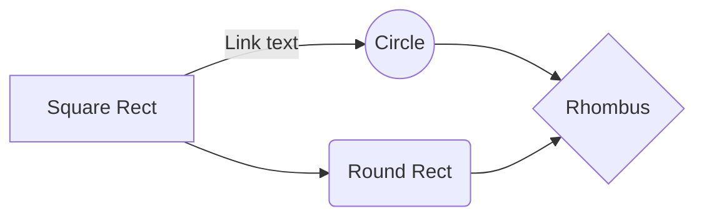
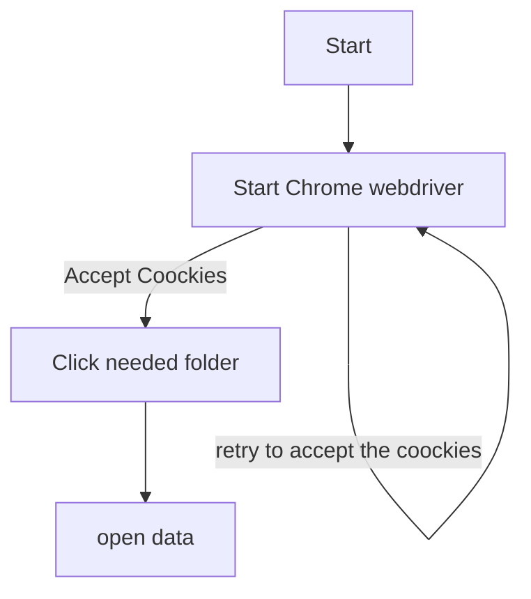
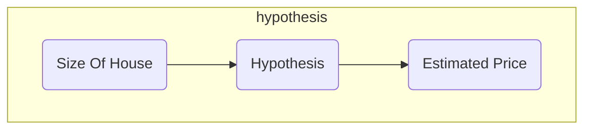

# Monthly Tourist Data for Greece and Spain

This is a **Web Scrapping** program. It is getting info from the **europa-eurostat** database and stores it in a local sqlite database.

## Contents

- [Monthly Tourist Data for Greece and Spain](#monthly-tourist-data-for-greece-and-spain)
  - [Contents](#contents)
  - [Libraries Used](#libraries-used)
  - [Files](#files)
  - [How to Use](#how-to-use)
  - [Database Configuration](#database-configuration)
    - [**nights_tour**](#nights_tour)
    - [**nights_non_residents**](#nights_non_residents)
    - [**arrivals_tour**](#arrivals_tour)
    - [**arrivals_non_residents**](#arrivals_non_residents)
  - [How is it running](#how-is-it-running)

## Libraries Used

This program is made for **_windows_** and exclusively in **_python_** so it needs these libraries in order to run:

1. **selenium**
2. **os**
3. **sqlite3**
4. **pandas**
5. **chromedriver_autoinstaller**

## Files

There are 5 python files in the project. Each one does something different from the other one.

1. **setup_db.py**. This file is setting up the database that we are gonna need, in order to save the data in the end. It requires only the library:
   - **sqlite3**
2. **check_db_info.py**. This file prints the information that is already stored in our database. It requires only the library:
   - **sqlite3**
3. **check_info_create_csv.py**. This file also prints the information that is already stored in our database using pandas dataframes. Also it exports the stored information to 4 different csv files, one for each table in our database. It requires the libraries:
   - **pandas**
   - **sqlite3**
4. **delete_everythin_from_db.py**. This file exist just to delete everything from the database, so that the main program can run again. It requires only the library:
   - **sqlite3**
5. Finally **get_info_from_webpage.py**. This is the main program. It opens the website and. It requires the libraries:
   - **sqlite3**
   - **selenium**
   - **chromedriver_autoinstaller**
   - **os**

## How to Use

> I am assuming that you have installed all the required libraries

- Firstly, you have to setup the database, by running the **setup_db.py** file
- After your database is set up
-
-

_Everything_ is going according to **plan**.

## Database Configuration

There are 4 tables in database.

### **nights_tour**

> |  column  | datatype | Primary key |
> | :------: | :------: | :---------: |
> | country  |   text   |   &#9745;   |
> | Y2020M07 |   text   |   &#9744;   |
> | Y2020M08 |   text   |   &#9744;   |
> | Y2020M09 |   text   |   &#9744;   |
> | Y2020M10 |   text   |   &#9744;   |
> | Y2020M11 |   text   |   &#9744;   |
> | Y2020M12 |   text   |   &#9744;   |
> | Y2020M01 |   text   |   &#9744;   |
> | Y2020M02 |   text   |   &#9744;   |
> | Y2020M03 |   text   |   &#9744;   |
> | Y2020M04 |   text   |   &#9744;   |

### **nights_non_residents**

> |  column  | datatype | Primary key |
> | :------: | :------: | :---------: |
> | country  |   text   |   &#9745;   |
> | Y2020M03 |   text   |   &#9744;   |
> | Y2020M04 |   text   |   &#9744;   |
> | Y2020M05 |   text   |   &#9744;   |
> | Y2020M06 |   text   |   &#9744;   |
> | Y2020M07 |   text   |   &#9744;   |
> | Y2020M08 |   text   |   &#9744;   |
> | Y2020M09 |   text   |   &#9744;   |
> | Y2020M10 |   text   |   &#9744;   |
> | Y2020M11 |   text   |   &#9744;   |
> | Y2020M12 |   text   |   &#9744;   |

### **arrivals_tour**

> |  column  | datatype | Primary key |
> | :------: | :------: | :---------: |
> | country  |   text   |   &#9745;   |
> | Y2020M03 |   text   |   &#9744;   |
> | Y2020M04 |   text   |   &#9744;   |
> | Y2020M05 |   text   |   &#9744;   |
> | Y2020M06 |   text   |   &#9744;   |
> | Y2020M07 |   text   |   &#9744;   |
> | Y2020M08 |   text   |   &#9744;   |
> | Y2020M09 |   text   |   &#9744;   |
> | Y2020M10 |   text   |   &#9744;   |
> | Y2020M11 |   text   |   &#9744;   |
> | Y2020M12 |   text   |   &#9744;   |

### **arrivals_non_residents**

> |  column  | datatype | Primary key |
> | :------: | :------: | :---------: |
> | country  |   text   |   &#9745;   |
> | Y2020M03 |   text   |   &#9744;   |
> | Y2020M04 |   text   |   &#9744;   |
> | Y2020M05 |   text   |   &#9744;   |
> | Y2020M06 |   text   |   &#9744;   |
> | Y2020M07 |   text   |   &#9744;   |
> | Y2020M08 |   text   |   &#9744;   |
> | Y2020M09 |   text   |   &#9744;   |
> | Y2020M10 |   text   |   &#9744;   |
> | Y2020M11 |   text   |   &#9744;   |
> | Y2020M12 |   text   |   &#9744;   |

## How is it running

