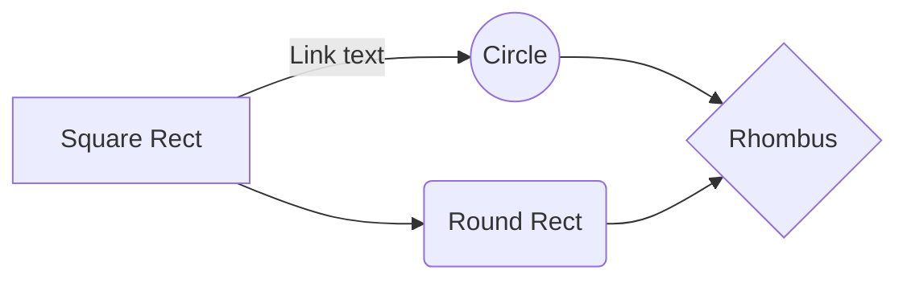

# Monthly Tourist Data for Greece and Spain

### This is a **Web Scrapping** program. It is getting info from the **europa-eurostat** database and stores it in a local sqlite database.

Detailed information about how this program runs you can find on the [Running](#How-is-it-running) segment and detailed information about the database you will find on the [Database](#Database-Configuration) segment

## Libraries Used

This program is made for **_windows_** and exclusively in **_python_** so it needs these libraries in order to run:

1. selenium
2. os
3. sqlite3
4. pandas
5. chromedriver_autoinstaller

## Files

There are 5 python files in the project. Each one does something different from the other one.

1. **setup_db.py**. This file is setting up the database that we are gonna need, in order to save the data in the end. It requires only the library:
   - **sqlite3**
2. **check_db_info.py**. This file prints the information that is already stored in our database. It requires only the library:
   - **sqlite3**
3. **check_info_create_csv.py**. This file also prints the information that is already stored in our database using pandas dataframes. Also it exports the stored information to 4 different csv files, one for each table in our database. It requires the libraries:
   - **pandas**
   - **sqlite3**
4. **delete_everythin_from_db.py**. This file exist just to delete everything from the database, so that the main program can run again. It requires only the library:
   - **sqlite3**
5. Finally **get_info_from_webpage.py**. This is the main program. It opens the website and

## How to Use

- Revenue was off the chart.
- Profits were higher than ever.
- Profits were higher than ever.
-
-
-

_Everything_ is going according to **plan**.

## How is it running

|                  | ASCII                           | HTML              |
| ---------------- | ------------------------------- | ----------------- |
| Single backticks | `'Isn't this fun?'`             | 'Isn't this fun?' |
| Quotes           | `"Isn't this fun?"`             | "Isn't this fun?" |
| Dashes           | `-- is en-dash, --- is em-dash` | is em-dash        |

## Database Configuration

| column   | datatype | Primary key        |
| -------- | -------- | ------------------ |
| country  | text     | :white_check_mark: |
| Y2020M07 |          |                    |
| Y2020M08 |          |                    |
